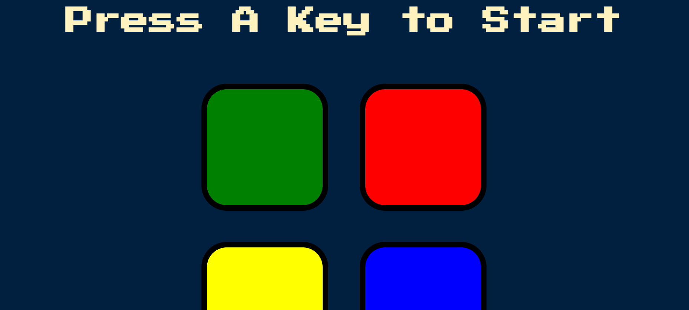
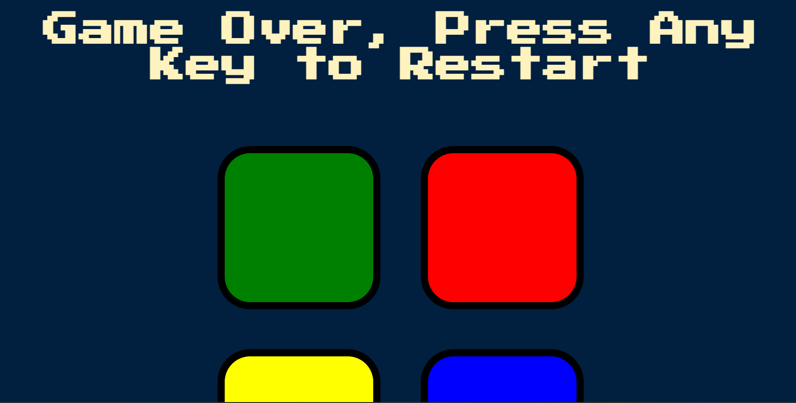

# Simon Game

This is a simple implementation of the classic Simon game using HTML, CSS, JavaScript and JQuery.

## Table of contents

- [Overview](#overview)
  - [Description](#Description)
  - [Features](#features)
  - [Screenshot](#screenshot)
  - [Links](#links)
- [My process](#my-process)
  - [Built with](#built-with)
  - [What I learned](#what-i-learned)
- [Author](#author)

## Overview

## Description

The Simon game is a memory game where the player needs to replicate a sequence of colors and sounds generated by the game. This project is a web-based implementation of the Simon game using front-end web technologies including jQuery for DOM manipulation.

### Features

- Random sequence generation of colors and sounds.
- Interactive buttons for user input.
- Sound effects to enhance the gaming experience.
- Game over functionality with restart option.

### Screenshot

### Links

- Solution URL: 
- Live Site URL: 

## My process

### Built with

- Semantic HTML5 markup
- CSS custom properties
- JavaScript
- JQuery - JavaScript library for DOM manipulation

### What I learned

This project helped me enhance my skills in:

- Using jQuery for DOM manipulation and event handling
- Incorporating external libraries into web projects
- Managing game logic and maintaining game state in JavaScript
- Implementing sound effects and visual feedback in a game application
- Enhancing user experience through interactive elements

## Author

- Website - [Neooo17]()
- Frontend Mentor - [@Neoo17]()